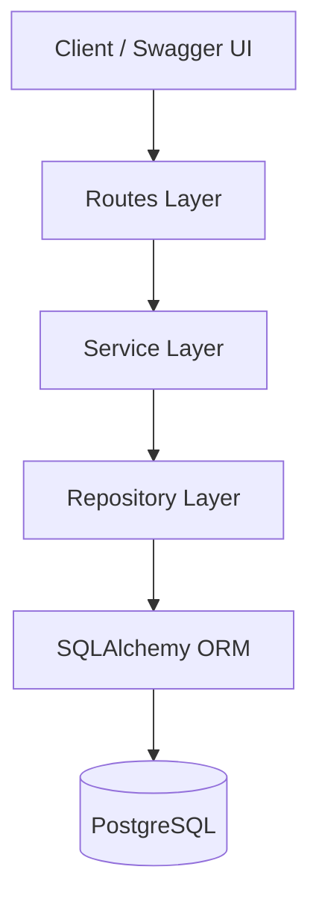

# Task Management API

## TL;DR

Task Management API is a CRUD-based backend service built using FastAPI, PostgreSQL, SQLAlchemy ORM, and Alembic migrations.

The system supports task creation, retrieval, updating, and deletion with proper layered architecture using:
- Route Layer
- Service Layer
- Repository Layer
- Database Layer

---

# Overview

## Problem Statement

The system provides a simple backend API for managing tasks in a structured and scalable manner.

The goal was to implement:
- Clean architecture
- Async database support
- PostgreSQL integration
- Dockerized database
- Alembic migrations
- Production-style project structure

---

## Solution Summary

The API uses:
- FastAPI for HTTP APIs
- SQLAlchemy Async ORM for database access
- PostgreSQL as the database
- Alembic for database migrations
- Repository pattern for DB abstraction
- Service layer for business logic separation


---

# Prerequisites & Dependencies

## System Dependencies

| Dependency | Purpose | Required Version |
|------------|---------|------------------|
| Python | Backend runtime | ≥3.13 |
| PostgreSQL | Primary database | ≥16 |
| Docker | Containerized DB | Latest |
| FastAPI | API framework | ≥0.136 |
| SQLAlchemy | ORM | ≥2.0 |
| Alembic | Migration system | ≥1.18 |

---

# Architecture

## System Flow Diagram

```text
Client Request
      ↓
FastAPI Route Layer
      ↓
Service Layer
      ↓
Repository Layer
      ↓
SQLAlchemy ORM
      ↓
PostgreSQL Database
```

---

## Layered Architecture Diagram



---

# Technical Implementation

# Backend

## Project Structure

```text
task-management/
│
├── alembic/
├── app/
│   ├── api/
│   ├── db/
│   ├── repositories/
│   ├── schemas/
│   ├── services/
│   └── main.py
│
├── docker-compose.yml
├── alembic.ini
├── requirements.txt
└── README.md
```

---

# API Endpoints

---

## POST `/tasks`

### Purpose

Create a new task.

### Authentication

None

---

### Request

```json
{
  "title": "Build Task API",
  "description": "Implement CRUD endpoints",
  "assigned_to": 1,
  "status": "todo"
}
```

---

### Response

```json
{
  "id": 1,
  "title": "Build Task API",
  "description": "Implement CRUD endpoints",
  "status": "todo",
  "assigned_to": 1,
  "created_at": "2026-05-21T06:17:20.055691",
  "updated_at": "2026-05-21T06:17:20.055691"
}
```

---

### Error Codes

| Code | Meaning |
|------|---------|
| 422 | Validation error |
| 500 | Internal server error |

---

# GET `/tasks`

## Purpose

Fetch all tasks.

## Authentication

None

---

## Response

```json
[
  {
    "id": 1,
    "title": "Build Task API",
    "description": "Implement CRUD endpoints",
    "status": "todo",
    "assigned_to": 1,
    "created_at": "2026-05-21T06:17:20.055691",
    "updated_at": "2026-05-21T06:17:20.055691"
  }
]
```

---

## Error Codes

| Code | Meaning |
|------|---------|
| 500 | Internal server error |

---

# GET `/tasks/{task_id}`

## Purpose

Fetch a single task by ID.

## Authentication

None

---

## Example Request

```text
GET /tasks/1
```

---

## Response

```json
{
  "id": 1,
  "title": "Build Task API",
  "description": "Implement CRUD endpoints",
  "status": "todo",
  "assigned_to": 1,
  "created_at": "2026-05-21T06:17:20.055691",
  "updated_at": "2026-05-21T06:17:20.055691"
}
```

---

## Error Codes

| Code | Meaning |
|------|---------|
| 404 | Task not found |
| 500 | Internal server error |

---

# PUT `/tasks/{task_id}`

## Purpose

Update an existing task.

## Authentication

None

---

## Request

```json
{
  "title": "Build Production API",
  "status": "done"
}
```

---

## Response

```json
{
  "id": 1,
  "title": "Build Production API",
  "description": "Implement CRUD endpoints",
  "status": "done",
  "assigned_to": 1,
  "created_at": "2026-05-21T06:17:20.055691",
  "updated_at": "2026-05-21T06:21:53.765000"
}
```

---

## Error Codes

| Code | Meaning |
|------|---------|
| 400 | No update fields provided |
| 404 | Task not found |
| 422 | Validation error |

---

# DELETE `/tasks/{task_id}`

## Purpose

Delete a task.

## Authentication

None

---

## Example Request

```text
DELETE /tasks/1
```

---

## Response

```text
204 No Content
```

---

## Error Codes

| Code | Meaning |
|------|---------|
| 404 | Task not found |
| 500 | Internal server error |

---

# Database Schema

## Table: `tm_users`

| Column | Type |
|--------|------|
| id | Integer |
| username | String |
| email | String |
| role | Enum |

---

## Table: `tm_tasks`

| Column | Type |
|--------|------|
| id | Integer |
| title | String |
| description | Text |
| status | Enum |
| assigned_to | Integer |
| created_at | DateTime |
| updated_at | DateTime |

---

# Alembic Migration System

## Migration Commands

### Generate Migration

```bash
alembic revision --autogenerate -m "message"
```

### Apply Migration

```bash
alembic upgrade head
```

### Rollback Migration

```bash
alembic downgrade -1
```

---

# Docker Setup

## Start PostgreSQL

```bash
docker compose up -d
```

---

## Stop PostgreSQL

```bash
docker compose down
```

---

# Manual Testing

## Open Swagger UI

```text
http://127.0.0.1:8000/docs
```

---

## Testing Steps

### Create Task
- Open POST `/tasks`
- Add request body
- Execute request

### Get Tasks
- Open GET `/tasks`
- Execute request

### Update Task
- Open PUT `/tasks/{task_id}`
- Modify fields
- Execute request

### Delete Task
- Open DELETE `/tasks/{task_id}`
- Execute request

---

# Files Modified

## Backend

| File | Purpose |
|------|---------|
| `app/main.py` | FastAPI application entrypoint |
| `app/api/routes.py` | API route definitions |
| `app/services/service.py` | Business logic |
| `app/repositories/repository.py` | Database access layer |
| `app/db/models.py` | SQLAlchemy ORM models |
| `app/db/database.py` | Database session configuration |
| `app/schemas/schemas.py` | Pydantic request/response schemas |
| `alembic/env.py` | Alembic migration environment |
| `docker-compose.yml` | PostgreSQL container setup |

---

# Developer Guidelines

## Do's

- Keep business logic inside the service layer
- Keep database logic inside the repository layer
- Use Alembic for schema changes
- Use async database sessions consistently

## Don'ts

- Do not write SQL queries directly inside routes
- Do not bypass the service layer
- Do not manually modify database schema without migrations

---

# Changelog

| Date | Author | Change |
|------|--------|--------|
| 2026-05-21 | Arpit Garg | Initial project documentation |