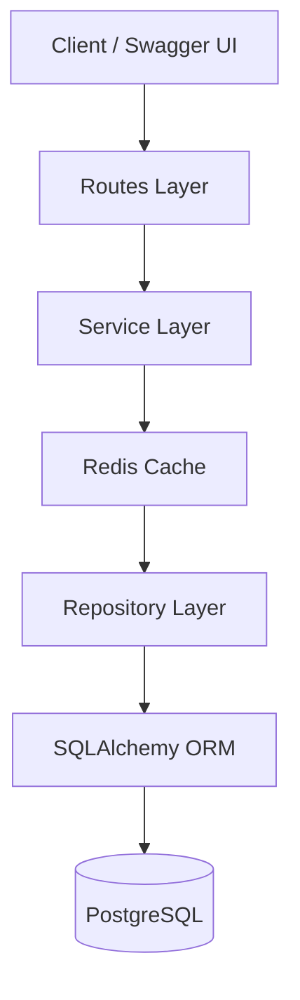

````markdown
---
title: Production-Ready Task Management API
author: Arpit Garg
created: 2026-05-21
updated: 2026-05-22
status: Active
ticket: INTERN-TASK-MANAGEMENT
pr: N/A
tags: fastapi, postgresql, sqlalchemy, alembic, redis, caching, async-api, state-machine
---

# Production-Ready Task Management API

## TL;DR (30 seconds read)

Production-ready Task Management API built using FastAPI, PostgreSQL, SQLAlchemy Async ORM, Redis caching, and layered architecture principles.

The system supports:
- CRUD task operations
- Redis caching with fallback handling
- Task status state machine validation
- Structured service/repository architecture
- Async database support
- Dockerized infrastructure
- Alembic migrations

The API is designed with scalability, maintainability, and production-style backend practices.

---

## Overview

### Problem Statement

The initial task management system required:
- Structured layered architecture
- Database abstraction
- Efficient task retrieval
- Controlled task lifecycle management
- Production-grade caching
- Reliable async database integration

Without caching and transition validation:
- Repeated DB reads increased latency
- Invalid task status transitions could corrupt workflow logic
- APIs lacked production resiliency

---

### Solution Summary

The solution introduces:
- Redis caching for task retrieval APIs
- Cache invalidation on task mutations
- Status state machine enforcement
- PostgreSQL async integration
- Repository + service-layer abstraction
- Graceful Redis fallback handling

---

### Key Metrics/Impact

| Metric | Before | After |
|--------|--------|-------|
| Task Fetch Source | PostgreSQL only | Redis + PostgreSQL fallback |
| Status Validation | None | Strict state machine |
| Cache Response Time | N/A | Near in-memory latency |
| Invalid Status Prevention | No | Yes |
| Fault Tolerance | Limited | Redis failure fallback supported |

---

## Prerequisites & Dependencies

### Required Knowledge

- [ ] FastAPI async APIs
- [ ] SQLAlchemy Async ORM
- [ ] PostgreSQL basics
- [ ] Redis caching fundamentals
- [ ] Alembic migrations
- [ ] Layered backend architecture

---

### System Dependencies

| Dependency | Purpose | Required Version |
|------------|---------|------------------|
| Python | Backend runtime | ≥3.13 |
| PostgreSQL | Primary database | ≥16 |
| Redis | Caching layer | ≥7 |
| Docker | Containerized infrastructure | Latest |
| FastAPI | API framework | ≥0.136 |
| SQLAlchemy | ORM | ≥2.0 |
| Alembic | Migration management | ≥1.18 |

---

### Related Documentation

- `README.md`
- `alembic/`
- `docker-compose.yml`

---

# Architecture

## System Flow Diagram

```text
Client Request
      ↓
FastAPI Route Layer
      ↓
Service Layer
      ↓
Redis Cache Check
      ↓
Repository Layer
      ↓
SQLAlchemy ORM
      ↓
PostgreSQL Database
````

---

## Layered Architecture Diagram



---

## Data Flow

### Task Retrieval

1. API request hits FastAPI route
2. Service checks Redis cache
3. On cache hit → return cached response
4. On cache miss → fetch from PostgreSQL
5. Response stored in Redis with TTL
6. Return response to client

---

### Task Update

1. Request validated
2. State machine validates status transition
3. Repository updates database
4. Related cache keys invalidated
5. Updated response returned

---

# Technical Implementation

# Backend

## Project Structure

```text
task-management/
│
├── alembic/
├── app/
│   ├── api/
│   ├── core/
│   ├── db/
│   ├── repositories/
│   ├── schemas/
│   ├── services/
│   ├── cache/
│   └── main.py
│
├── docker-compose.yml
├── alembic.ini
├── requirements.txt
└── README.md
```

---

## API Endpoints

---

### `POST /tasks`

**Purpose:** Create a new task

**Authentication:** None

---

### Request

```json
{
  "title": "Build Redis Cache",
  "description": "Implement caching layer",
  "assigned_to": 1,
  "status": "pending"
}
```

---

### Response

```json
{
  "id": 1,
  "title": "Build Redis Cache",
  "description": "Implement caching layer",
  "status": "pending",
  "assigned_to": 1,
  "created_at": "2026-05-22T10:15:20.055691",
  "updated_at": "2026-05-22T10:15:20.055691"
}
```

---

### Error Codes

| Code | Meaning               | Resolution                  |
| ---- | --------------------- | --------------------------- |
| 422  | Validation error      | Validate request body       |
| 500  | Internal server error | Check server logs           |
| 400  | Invalid assignment    | Ensure assigned user exists |

---

## `GET /tasks`

### Purpose

Fetch all tasks.

### Authentication

None

---

### Cache

| Cache Key              | TTL         |
| ---------------------- | ----------- |
| `tasks:user:{user_id}` | 300 seconds |

---

### Response

```json
[
  {
    "id": 1,
    "title": "Build Redis Cache",
    "description": "Implement caching layer",
    "status": "pending",
    "assigned_to": 1
  }
]
```

---

### Logging

```text
[CACHE HIT] tasks:user:1
[CACHE MISS] tasks:user:1
```

---

## `GET /tasks/{task_id}`

### Purpose

Fetch task by ID.

---

### Cache

| Cache Key        | TTL         |
| ---------------- | ----------- |
| `task:{task_id}` | 300 seconds |

---

### Response

```json
{
  "id": 1,
  "title": "Build Redis Cache",
  "description": "Implement caching layer",
  "status": "pending",
  "assigned_to": 1
}
```

---

### Logging

```text
[CACHE HIT] task:1
[CACHE MISS] task:1
```

---

## `PUT /tasks/{task_id}`

### Purpose

Update task details and status.

---

### Status State Machine

| Current Status | Allowed Transitions    |
| -------------- | ---------------------- |
| pending        | in_progress, cancelled |
| in_progress    | completed, cancelled   |
| completed      | Not allowed            |
| cancelled      | Not allowed            |

---

### Valid Example

```json
{
  "status": "in_progress"
}
```

---

### Invalid Example

```json
{
  "status": "pending"
}
```

From:

```text
completed → pending
```

---

### Invalid Transition Response

```json
{
  "detail": "Invalid status transition from completed to pending"
}
```

---

### Logging

```text
[STATUS CHANGE]
task_id=1
user_id=1
old_status=pending
new_status=in_progress
timestamp=2026-05-22T10:20:00Z
```

---

## `DELETE /tasks/{task_id}`

### Purpose

Delete task by ID.

---

### Response

```text
204 No Content
```

---

### Cache Handling

On delete:

* `task:{task_id}` invalidated
* `tasks:user:{user_id}` invalidated

---

# Redis Caching

## Cache Strategy

| Operation          | Cache Key              | TTL  |
| ------------------ | ---------------------- | ---- |
| Get Task By ID     | `task:{task_id}`       | 300s |
| List Tasks By User | `tasks:user:{user_id}` | 300s |

---

## Cache Invalidation

Performed on:

* Task creation
* Task update
* Task deletion

---

## Redis Failure Handling

If Redis is unavailable:

* API falls back to PostgreSQL
* Request must still succeed
* Warning logs generated

---

## Example Log

```text
[REDIS ERROR] Falling back to DB
```

---

# Database Schema

## Table: `tm_users`

| Column   | Type    |
| -------- | ------- |
| id       | Integer |
| username | String  |
| email    | String  |
| role     | Enum    |

---

## Table: `tm_tasks`

| Column      | Type     |
| ----------- | -------- |
| id          | Integer  |
| title       | String   |
| description | Text     |
| status      | Enum     |
| assigned_to | Integer  |
| created_at  | DateTime |
| updated_at  | DateTime |

---

# Alembic Migration System

## Generate Migration

```bash
alembic revision --autogenerate -m "message"
```

---

## Apply Migration

```bash
alembic upgrade head
```

---

## Rollback Migration

```bash
alembic downgrade -1
```

---

# Docker Setup

## Start Infrastructure

```bash
docker compose up -d
```

---

## Verify Containers

```bash
docker ps
```

---

# Running the Application

## Start FastAPI Server

```bash
uvicorn app.main:app --reload
```

---

## Swagger UI

```text
http://127.0.0.1:8000/docs
```

---

# Testing

## How to Test Manually

### Create User

Insert user into PostgreSQL before assigning tasks.

```sql
INSERT INTO tm_users (username, email, role)
VALUES ('alice', 'alice@gmail.com', 'user');
```

---

### Create Task

1. Open Swagger UI
2. Execute `POST /tasks`
3. Use valid `assigned_to`

---

### Test Cache

1. Call `GET /tasks/1`
2. Observe:

```text
[CACHE MISS]
```

3. Call again
4. Observe:

```text
[CACHE HIT]
```

---

### Test State Machine

#### Valid Transition

```text
pending → in_progress
```

#### Invalid Transition

```text
completed → pending
```

Expected:

```json
{
  "detail": "Invalid status transition"
}
```

---

## Edge Cases

| Edge Case                 | Handling               |
| ------------------------- | ---------------------- |
| Redis unavailable         | Fallback to PostgreSQL |
| Invalid status transition | HTTP 400               |
| Missing assigned user     | Foreign key validation |
| Non-existent task         | HTTP 404               |

---

# Error Handling & Observability

## Logging

| Log Pattern       | Meaning           | Action                |
| ----------------- | ----------------- | --------------------- |
| `[CACHE HIT]`     | Redis hit         | Normal                |
| `[CACHE MISS]`    | Redis miss        | Normal                |
| `[REDIS ERROR]`   | Redis unavailable | Check Redis container |
| `[STATUS CHANGE]` | Status updated    | Audit tracking        |

---

## Common Errors & Troubleshooting

| Error                       | Cause                   | Resolution                  |
| --------------------------- | ----------------------- | --------------------------- |
| `ForeignKeyViolationError`  | User does not exist     | Insert user into `tm_users` |
| `Connection refused`        | PostgreSQL/Redis down   | Start Docker containers     |
| `Invalid status transition` | State machine violation | Use allowed transition      |

---

# Files Modified

## Backend

| File                             | Purpose                         |
| -------------------------------- | ------------------------------- |
| `app/main.py`                    | FastAPI application entrypoint  |
| `app/api/routes.py`              | API route definitions           |
| `app/services/service.py`        | Business logic + state machine  |
| `app/repositories/repository.py` | Database abstraction            |
| `app/db/models.py`               | SQLAlchemy ORM models           |
| `app/db/database.py`             | Async DB session setup          |
| `app/cache/cache.py`             | Redis cache handling            |
| `app/schemas/schemas.py`         | Pydantic schemas                |
| `alembic/env.py`                 | Alembic migration configuration |
| `docker-compose.yml`             | PostgreSQL + Redis containers   |

---

# Developer Guidelines

## Do's

* Keep business logic inside service layer
* Keep DB operations inside repository layer
* Validate task status transitions
* Invalidate cache after mutations
* Use async DB sessions consistently
* Handle Redis failures gracefully

---

## Don'ts

* Do not query DB directly from routes
* Do not bypass service layer
* Do not update status without validation
* Do not rely entirely on Redis availability

---

# Future Enhancements

## Planned

* [ ] Celery background task processing
* [ ] Task assignment concurrency handling
* [ ] Bulk task operations
* [ ] Query filtering and pagination
* [ ] Integration testing
* [ ] Prometheus metrics

---

# Changelog

| Date       | Author     | Change                                        |
| ---------- | ---------- | --------------------------------------------- |
| 2026-05-21 | Arpit Garg | Initial CRUD documentation                    |
| 2026-05-22 | Arpit Garg | Added Redis caching documentation             |
| 2026-05-22 | Arpit Garg | Added task status state machine documentation |

```
```