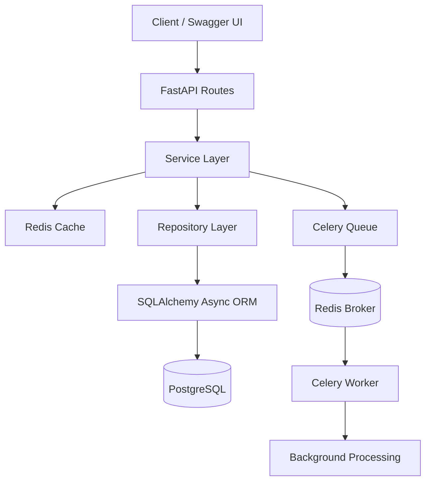
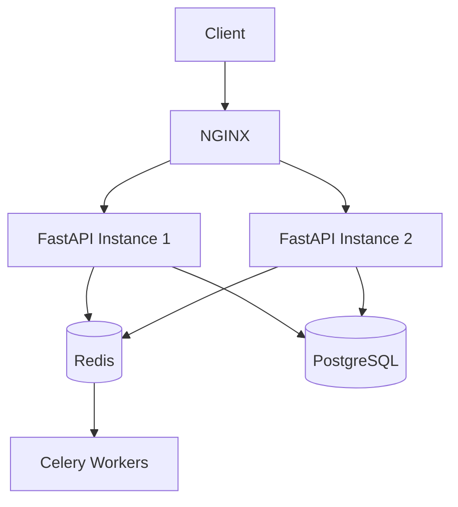

# ARCHITECTURE.md

# Task Management API — Architecture Documentation

Version: `v1`
Project: `task-management-api`
Architecture Style: `Layered Async Backend Architecture`
Primary Stack: `FastAPI + PostgreSQL + Redis + Celery`

---

# 1. System Overview

This API is designed as a production-oriented asynchronous backend system for task lifecycle management.

The architecture focuses on:

* Clear separation of concerns
* Async request handling
* Scalable service layering
* Controlled task state transitions
* Cache optimization
* Background task processing
* Failure resilience
* Concurrent-safe assignment handling
* Bulk operation support

The system follows a layered architecture pattern:

```text
Client
   ↓
Routes Layer
   ↓
Service Layer
   ↓
Repository Layer
   ↓
Database

Additional Components:
- Redis Cache
- Celery Worker
- Background Queue
```

---

# 2. High-Level Architecture



---

# 3. Architectural Principles

The implementation follows several backend engineering principles:

| Principle                | Usage                                   |
| ------------------------ | --------------------------------------- |
| Separation of Concerns   | Routes, services, repositories isolated |
| Async-First Design       | Async DB + FastAPI                      |
| Stateless APIs           | No request session state                |
| Layered Architecture     | Predictable dependency flow             |
| Cache Aside Pattern      | Redis fallback to DB                    |
| Controlled State Machine | Strict task lifecycle validation        |
| Background Processing    | Celery workers                          |
| Graceful Degradation     | Redis failure does not break APIs       |
| Concurrency Safety       | Atomic assignment updates               |
| Extensibility            | New modules can be added independently  |

---

# 4. Complete Request Lifecycle

---

# 4.1 Standard Request Flow

Example: `GET /tasks/1`

```text
Client
   ↓
Route Handler
   ↓
Service Layer
   ↓
Redis Cache Lookup
   ↓
Cache Hit → Return Response

OR

Cache Miss
   ↓
Repository Layer
   ↓
SQLAlchemy Async ORM
   ↓
PostgreSQL
   ↓
Service Layer
   ↓
Redis Cache Set
   ↓
Response
```

---

# 4.2 Background Processing Flow

Example: Task marked as completed

```text
PUT /tasks/{id}
   ↓
TaskService.update()
   ↓
State Transition Validation
   ↓
Database Update
   ↓
Cache Invalidation
   ↓
Celery Task Queued
   ↓
Redis Broker
   ↓
Celery Worker
   ↓
Async Processing Pipeline
```

---

# 5. Folder-Level Architecture

```text
app/
│
├── api/
├── core/
├── db/
├── repositories/
├── schemas/
├── services/
├── utils/
├── tasks.py
└── main.py
```

Each directory owns a single architectural responsibility.

---

# 6. Layer-by-Layer Breakdown

---

# 6.1 API Layer (`app/api`)

File:

```text
routes.py
```

Responsibility:

* HTTP endpoint declaration
* Query parameter parsing
* Dependency injection
* Request/response binding
* Delegation to services

The routes layer intentionally contains:

* No business logic
* No DB queries
* No caching logic
* No workflow logic

This keeps the API surface lightweight and maintainable.

Example flow:

```python
@router.get("/{task_id}")
async def get(task_id: int, db: AsyncSession = Depends(get_db)):
    return await TaskService.get(db, task_id)
```

---

# 6.2 Service Layer (`app/services`)

File:

```text
service.py
```

This is the core orchestration layer.

Responsibilities:

* Business rules
* State validation
* Cache orchestration
* Transaction coordination
* Event triggering
* Celery dispatching
* Response transformation
* Error handling

The service layer acts as the application brain.

---

## Internal Components

### TaskService

Primary orchestration class.

Handles:

| Method              | Responsibility                   |
| ------------------- | -------------------------------- |
| create              | Task creation                    |
| get                 | Cache-aware retrieval            |
| list                | Filtering + pagination           |
| update              | State validation + async trigger |
| delete              | Cleanup + invalidation           |
| assign_task_to_user | Concurrent-safe assignment       |
| bulk_create         | Partial-failure bulk insertion   |
| bulk_update_status  | Partial-failure updates          |

---

### TaskStateMachine

Controls legal task transitions.

```text
PENDING
 ├── IN_PROGRESS
 └── CANCELLED

IN_PROGRESS
 ├── COMPLETED
 └── CANCELLED
```

Invalid transitions are rejected before persistence.

This prevents workflow corruption.

---

### Response Mapping

```python
to_response(task: Task) -> TaskResponse
```

Prevents ORM leakage into API contracts.

The service layer always returns schema-safe objects.

---

# 6.3 Repository Layer (`app/repositories`)

File:

```text
repository.py
```

Responsibilities:

* Raw database interaction
* SQL query execution
* ORM persistence
* Atomic update operations

The repository layer contains:

* No HTTP logic
* No business rules
* No cache logic
* No workflow logic

---

## Query Design

Uses SQLAlchemy async execution:

```python
await session.execute(stmt)
```

Benefits:

* Non-blocking DB operations
* High concurrent throughput
* Efficient event loop usage

---

## Atomic Assignment Protection

Critical implementation:

```python
update(Task)
.where(
    Task.id == task_id,
    Task.status == TaskStatus.PENDING,
    Task.assigned_to.is_(None),
)
```

This prevents race conditions where multiple requests attempt assignment simultaneously.

Only one request succeeds.

---

# 6.4 Database Layer (`app/db`)

Files:

```text
database.py
models.py
```

---

## Async Engine

```python
create_async_engine()
```

Enables async DB communication through `asyncpg`.

---

## Session Management

```python
AsyncSessionLocal
```

Each request gets an isolated async session.

---

## ORM Models

### User Model

```text
tm_users
```

Stores:

* identity
* role
* active state

---

### Task Model

```text
tm_tasks
```

Stores:

* metadata
* workflow status
* assignment
* timestamps

---

## Relationship Mapping

```python
assigned_tasks = relationship("Task")
```

Bi-directional ORM relationships simplify future expansions.

---

# 6.5 Redis Layer (`app/core/redis.py`)

Implements cache-aside architecture.

---

## Responsibilities

* Cache reads
* Cache writes
* Cache invalidation
* Failure handling
* Logging

---

## Cache Flow

### Read

```text
Redis GET
   ↓
Hit → Return

Miss → DB Query
```

### Write

```text
DB Result
   ↓
Redis SETEX
```

---

## Failure Tolerance

Redis is optional infrastructure.

If Redis fails:

```python
except Exception:
    return None
```

The API still functions using PostgreSQL.

This improves production resilience.

---

## Cache Keys

Defined in:

```text
utils/cache_key.py
```

Current strategy:

| Key             | Purpose           |
| --------------- | ----------------- |
| task:{id}       | Single task cache |
| tasks:user:{id} | User task cache   |

---

## Cache TTL

```python
ttl=300
```

5-minute cache window.

---

# 6.6 Celery Architecture (`tasks.py` + `celery_app.py`)

The system uses asynchronous workers for deferred processing.

---

## Components

| Component    | Responsibility         |
| ------------ | ---------------------- |
| Celery App   | Worker configuration   |
| Redis Broker | Queue transport        |
| Worker       | Task execution         |
| Shared Task  | Distributed processing |

---

## Queue Routing

```python
task_routes = {
    "app.tasks.process_task_completion": {
        "queue": "task_completion_queue"
    }
}
```

Dedicated queue separation improves scalability.

---

## Retry Strategy

```python
max_retries=3
retry_backoff=True
retry_jitter=True
```

Production-grade retry behavior:

* exponential backoff
* randomized retry jitter
* bounded retry count

---

## Current Async Workflow

When task completes:

```text
Notification Processing
Analytics Processing
Activity Feed Update
Search Index Update
```

All executed asynchronously outside request lifecycle.

---

# 6.7 Schema Layer (`app/schemas`)

Defines API contracts.

Uses Pydantic models for:

* validation
* serialization
* response formatting

---

## Input Validation

Example:

```python
title: str = Field(..., min_length=1, max_length=255)
```

Validation occurs before service execution.

---

## Output Serialization

```python
ConfigDict(from_attributes=True)
```

Allows ORM-to-schema transformation.

---

## Bulk Operation Schemas

Separate response contracts support partial failures.

Example:

```json
{
  "success": false,
  "error": "Task not found"
}
```

---

# 6.8 Configuration Layer (`app/core/config.py`)

Uses:

```python
pydantic-settings
```

Responsibilities:

* environment loading
* runtime configuration
* secret isolation

---

# 7. Data Flow Analysis

---

# 7.1 Create Task Flow

```text
POST /tasks
   ↓
TaskService.create()
   ↓
Repository.create_task()
   ↓
PostgreSQL INSERT
   ↓
Commit
   ↓
Cache Invalidation
   ↓
Response
```

---

# 7.2 Get Task Flow

```text
GET /tasks/{id}
   ↓
Redis GET
   ↓
Cache Hit → Return

OR

Cache Miss
   ↓
DB SELECT
   ↓
Redis SETEX
   ↓
Return
```

---

# 7.3 Update Status Flow

```text
PUT /tasks/{id}
   ↓
Transition Validation
   ↓
DB UPDATE
   ↓
Commit
   ↓
Cache Delete
   ↓
Celery Queue
```

---

# 7.4 Assignment Flow

```text
POST /tasks/{id}/assign
   ↓
User Validation
   ↓
Task Validation
   ↓
Atomic SQL UPDATE
   ↓
Commit
```

---

# 8. Bulk Operation Design

Bulk APIs intentionally support partial failures.

Example:

```text
Task 1 → Success
Task 2 → Failure
Task 3 → Success
```

Instead of failing entire batch.

---

## Design Benefit

Improves operational reliability for:

* admin panels
* automation systems
* integrations
* migration jobs

---

# 9. Logging Architecture

Structured logging is implemented across:

* cache layer
* workers
* task transitions
* startup lifecycle

---

## Logging Categories

| Logger      | Purpose          |
| ----------- | ---------------- |
| task_status | Task lifecycle   |
| task_worker | Celery worker    |
| cache       | Redis operations |

---

## Example Logs

```text
[CACHE HIT]
[CACHE MISS]
[TASK QUEUED]
[TASK WORKER START]
```

---

# 10. Database Architecture

---

# 10.1 Tables

## tm_users

Stores platform users.

---

## tm_tasks

Stores task lifecycle state.

---

# 10.2 Relationships

```text
User 1 ────< Many Tasks
```

---

# 11. Failure Handling Strategy

---

# 11.1 Redis Failure

Fallback to PostgreSQL.

No request failure.

---

# 11.2 Celery Failure

Retries automatically.

---

# 11.3 Invalid Workflow

Rejected before persistence.

---

# 12. Infrastructure Architecture

Dockerized local infrastructure:

```text
Docker Compose
   ├── PostgreSQL
   └── Redis
```

---

## PostgreSQL

* persistent storage
* transactional consistency

---

## Redis

Dual-purpose infrastructure:

* caching
* Celery broker/backend

---

# 13. Scalability Considerations

The architecture is designed for horizontal scaling.

---

## Redis Centralization

Shared cache + queue broker.

---

## Worker Isolation

Celery workers can scale independently.

Example:

```text
Worker 1 → notifications
Worker 2 → indexing
Worker 3 → analytics
```

---

## Async I/O

Improves throughput under concurrent load.

---

# 14. Current Architectural Strengths

| Area            | Strength                |
| --------------- | ----------------------- |
| API Layer       | Clean separation        |
| DB Layer        | Fully async             |
| Caching         | Graceful fallback       |
| Workflows       | Strict state machine    |
| Concurrency     | Atomic updates          |
| Scalability     | Queue-based async       |
| Reliability     | Retry mechanisms        |
| Bulk APIs       | Partial failure support |
| Infrastructure  | Dockerized              |
| Maintainability | Layered design          |

---

# 15. Current Architectural Limitations

| Area                | Limitation                 |
| ------------------- | -------------------------- |
| Authentication      | Not implemented            |
| Authorization       | Role enforcement missing   |
| Distributed Locking | Not implemented            |
| Metrics             | No Prometheus/Grafana      |
| Tracing             | No OpenTelemetry           |
| API Versioning      | Missing                    |
| Test Suite          | Not implemented            |
| Pagination Metadata | Missing total counts       |
| Dead Letter Queues  | Missing                    |
| Worker Monitoring   | Missing Flower integration |

---


# 16. Production Deployment Architecture

Recommended deployment:



---

# 17. Architectural Summary

This project implements a production-style async backend architecture using:

* Layered service design
* Async PostgreSQL integration
* Redis cache-aside strategy
* Celery distributed processing
* State-machine controlled workflows
* Concurrent-safe assignment logic
* Graceful infrastructure failure handling

The architecture is modular, scalable, fault-tolerant, and extensible for future enterprise-grade backend evolution.
