# WORKFLOW.md

# Task Management API — Internal Workflow Documentation

Version: `v1`
Project: `task-management`
Purpose: `Request lifecycle and route interaction documentation`

---

# 1. Overview

This document explains the complete internal workflow of every API route.

Focus areas:

* Route execution flow
* Service orchestration
* Cache interaction
* Repository interaction
* Database operations
* Celery workflow triggering
* Transaction lifecycle
* Failure handling
* Concurrency protection

Swagger already documents request/response contracts.

This document explains:

```text
HOW requests move internally through the system
```

---

# 2. Core Request Lifecycle

Every request follows the same architectural pipeline.

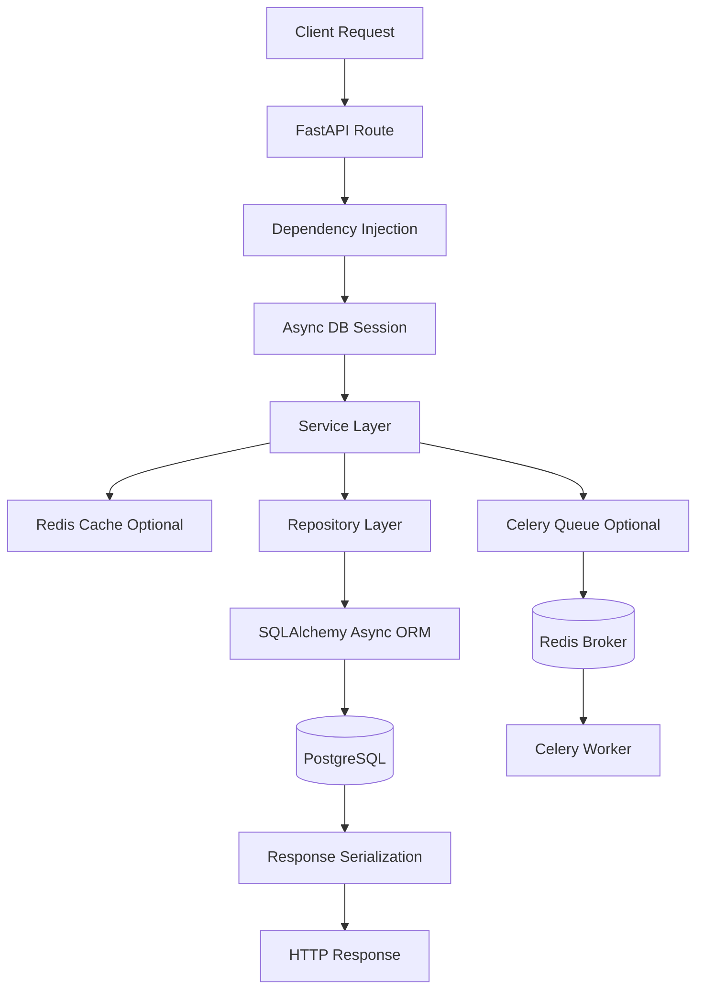

---

# 3. Route Execution Standard

Every route follows this structure:

```text
Request
   ↓
Route Handler
   ↓
Validation
   ↓
Service Layer
   ↓
Repository Layer
   ↓
Database
   ↓
Response Mapping
   ↓
Response
```

The route layer remains intentionally thin.

---

# 4. Route Workflows

---

# 4.1 POST `/tasks`

## Purpose

Create a new task.

---

# Internal Flow

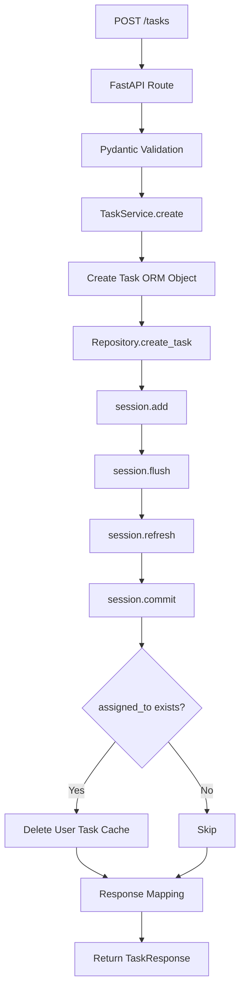

---

# Internal Logic

### Route Layer

Receives validated `TaskCreateRequest`.

### Service Layer

* Creates ORM entity
* Calls repository
* Commits transaction
* Invalidates related cache

### Repository Layer

Responsible only for persistence operations.

### Cache Layer

If task assigned:

```text
tasks:user:{user_id}
```

cache gets invalidated.

---

# Database Interaction

```sql
INSERT INTO tm_tasks (...)
VALUES (...)
```

---

# 4.2 GET `/tasks`

## Purpose

Fetch tasks with filtering, pagination, and sorting.

---

# Internal Flow

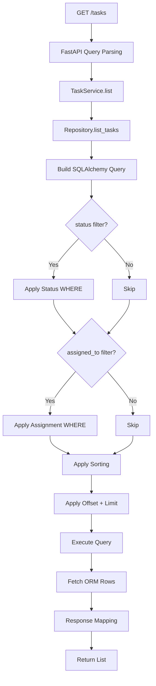

---

# Internal Logic

Supports:

| Feature        | Internal Implementation    |
| -------------- | -------------------------- |
| Filtering      | Dynamic WHERE clauses      |
| Pagination     | OFFSET + LIMIT             |
| Sorting        | Dynamic ORDER BY           |
| Async Querying | SQLAlchemy async execution |

---

# SQL Query Pattern

```sql
SELECT *
FROM tm_tasks
WHERE ...
ORDER BY ...
LIMIT ...
OFFSET ...
```

---

# 4.3 GET `/tasks/{task_id}`

## Purpose

Fetch a single task with Redis cache optimization.

---

# Internal Flow

```mermaid
flowchart TD

A[GET /tasks/{id}]

A --> B[TaskService.get]

B --> C[Generate Cache Key]

C --> D[Redis GET]

D --> E{Cache Hit?}

E -->|Yes| F[Deserialize JSON]

F --> G[Return Cached Response]

E -->|No| H[Repository.get_task]

H --> I[Database SELECT]

I --> J{Task Exists?}

J -->|No| K[404 Error]

J -->|Yes| L[Response Mapping]

L --> M[Redis SETEX]

M --> N[Return Response]
```

---

# Cache Flow

## Cache Key

```text
task:{task_id}
```

---

## Cache Hit

```text
Redis
   ↓
Immediate Response
```

No database call occurs.

---

## Cache Miss

```text
Redis Miss
   ↓
PostgreSQL Query
   ↓
Cache Population
```

---

# Database Interaction

```sql
SELECT *
FROM tm_tasks
WHERE id = ?
```

---

# Redis Interaction

```python
GET task:1
SETEX task:1 300 {...}
```

---

# 4.4 PUT `/tasks/{task_id}`

## Purpose

Update task fields and enforce workflow transitions.

---

# Internal Flow

```mermaid
flowchart TD

A[PUT /tasks/{id}]

A --> B[Pydantic Validation]

B --> C[TaskService.update]

C --> D[Repository.get_task]

D --> E{Task Exists?}

E -->|No| F[404 Error]

E -->|Yes| G[Load Current State]

G --> H{status update requested?}

H -->|No| I[Direct Update]

H -->|Yes| J[Validate State Transition]

J --> K{Transition Valid?}

K -->|No| L[400 Invalid Transition]

K -->|Yes| M{New Status = COMPLETED?}

M -->|No| I

M -->|Yes| N[Update DB]

N --> O[Commit]

O --> P[Cache Invalidation]

P --> Q[Queue Celery Task]

Q --> R[Return Response]

I --> S[Repository.update_task]

S --> T[Commit]

T --> U[Cache Invalidation]

U --> V[Structured Logging]

V --> W[Return Response]
```

---

# State Machine Validation

Allowed transitions:

```text
PENDING
 ├── IN_PROGRESS
 └── CANCELLED

IN_PROGRESS
 ├── COMPLETED
 └── CANCELLED
```

---

# Special Workflow: COMPLETED Status

If task becomes completed:

```text
DB Update
   ↓
Commit
   ↓
Cache Cleanup
   ↓
Celery Dispatch
```

---

# Celery Trigger

```python
process_task_completion.delay(task.id)
```

---

# Cache Invalidation

Deletes:

```text
task:{task_id}
tasks:user:{user_id}
```

---

# Logging

Structured lifecycle logging:

```text
[TASK STATUS CHANGE]
```

---

# 4.5 DELETE `/tasks/{task_id}`

## Purpose

Delete a task and cleanup cache.

---

# Internal Flow

```mermaid
flowchart TD

A[DELETE /tasks/{id}]

A --> B[TaskService.delete]

B --> C[Repository.get_task]

C --> D{Task Exists?}

D -->|No| E[404 Error]

D -->|Yes| F[Repository.delete_task]

F --> G[DELETE Query]

G --> H[Commit Transaction]

H --> I[Delete Task Cache]

I --> J{assigned user exists?}

J -->|Yes| K[Delete User Cache]

J -->|No| L[Skip]

K --> M[Return 204]

L --> M
```

---

# Database Interaction

```sql
DELETE FROM tm_tasks
WHERE id = ?
RETURNING id
```

---

# Cache Cleanup

Deletes:

```text
task:{task_id}
tasks:user:{user_id}
```

---

# 4.6 POST `/tasks/{task_id}/assign`

## Purpose

Assign pending task to a user safely.

---

# Internal Flow

```mermaid
flowchart TD

A[POST /tasks/{id}/assign]

A --> B[TaskService.assign_task_to_user]

B --> C[Repository.get_user]

C --> D{User Valid + Active?}

D -->|No| E[400 Error]

D -->|Yes| F[Repository.get_task]

F --> G{Task Exists?}

G -->|No| H[404 Error]

G -->|Yes| I{Task Pending?}

I -->|No| J[400 Not Assignable]

I -->|Yes| K{Already Assigned?}

K -->|Yes| L[400 Already Assigned]

K -->|No| M[Atomic UPDATE Query]

M --> N{Update Succeeded?}

N -->|No| O[409 Conflict]

N -->|Yes| P[Commit]

P --> Q[Cache Cleanup]

Q --> R[Return Updated Task]
```

---

# Concurrency Protection

Critical protection logic:

```python
.where(
    Task.id == task_id,
    Task.status == TaskStatus.PENDING,
    Task.assigned_to.is_(None),
)
```

---

# Why This Matters

Without atomic updates:

```text
Request A assigns task
Request B assigns same task
```

Both could succeed.

Current implementation ensures:

```text
Only one assignment succeeds
```

---

# Conflict Response

If race condition occurs:

```text
409 Conflict
```

---

# 4.7 POST `/tasks/bulk`

## Purpose

Bulk create tasks with partial failure handling.

---

# Internal Flow

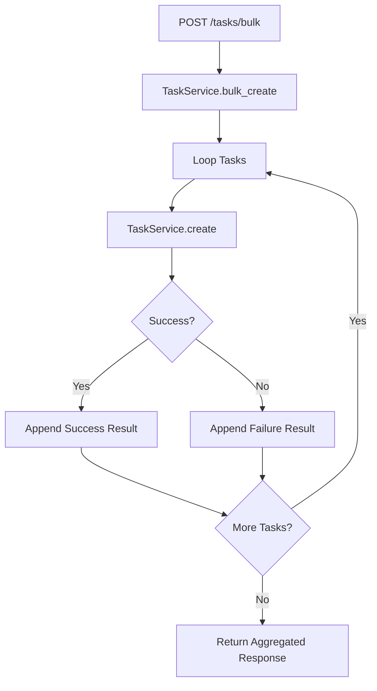

---

# Design Philosophy

Bulk operations:

* never fail entire batch
* isolate failures per item
* preserve successful operations

---

# Example Partial Failure

```json
{
  "results": [
    {
      "success": true
    },
    {
      "success": false,
      "error": "Validation failed"
    }
  ]
}
```

---

# 4.8 PUT `/tasks/bulk/status`

## Purpose

Bulk update task statuses with workflow validation.

---

# Internal Flow

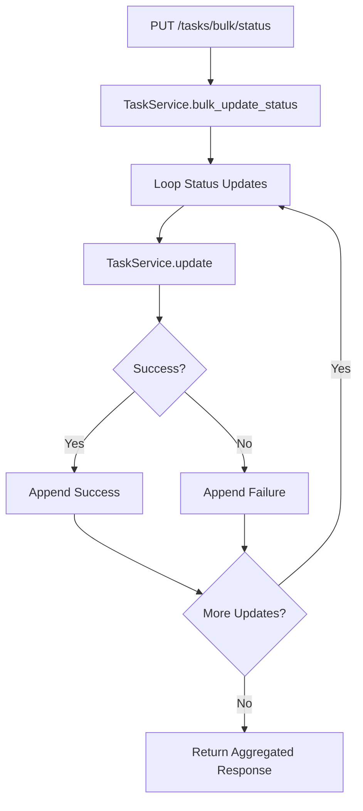

---

# Internal Characteristics

Each task update independently executes:

* validation
* workflow checks
* cache invalidation
* Celery dispatch

---

# 5. Repository Workflow Details

The repository layer is responsible only for persistence logic.

---

# Repository Interaction Pattern

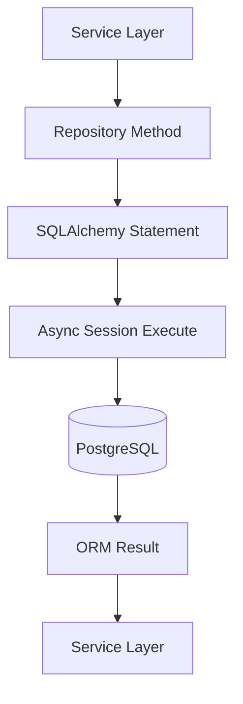

---

# Repository Responsibilities

| Responsibility     | Included |
| ------------------ | -------- |
| SELECT queries     | Yes      |
| UPDATE queries     | Yes      |
| DELETE queries     | Yes      |
| Transaction commit | No       |
| Validation         | No       |
| Cache handling     | No       |
| Business logic     | No       |

---

# 6. Redis Workflow

---

# Read Flow

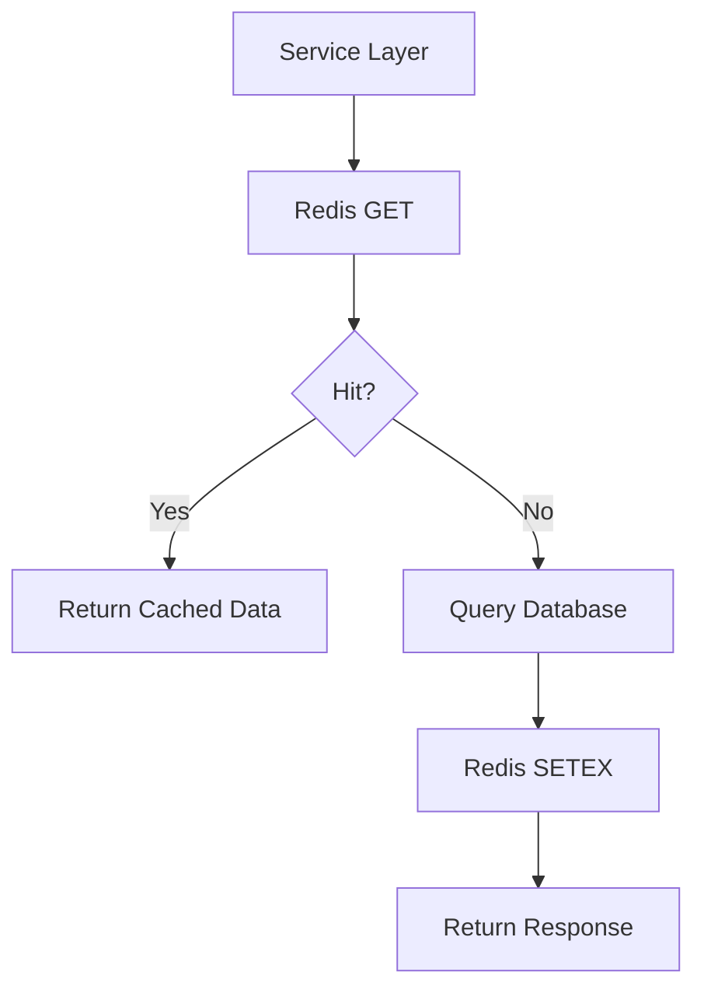

---

# Write Invalidation Flow

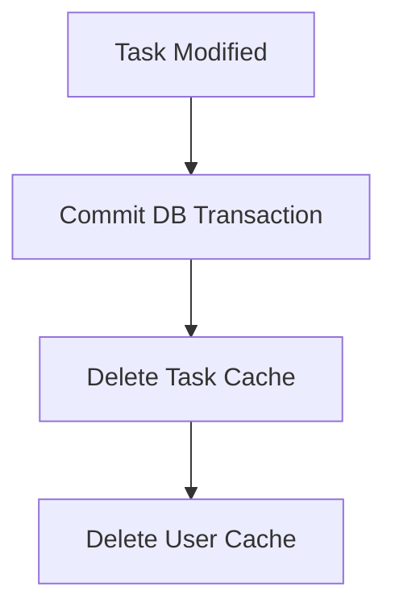

---

# Failure Handling

If Redis unavailable:

```text
Fallback to PostgreSQL
```

No API failure occurs.

---

# 7. Celery Internal Workflow

---

# Trigger Flow

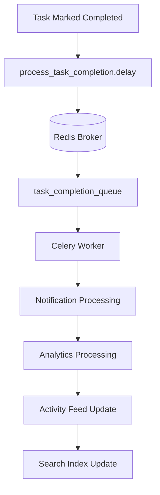

---

# Retry Workflow

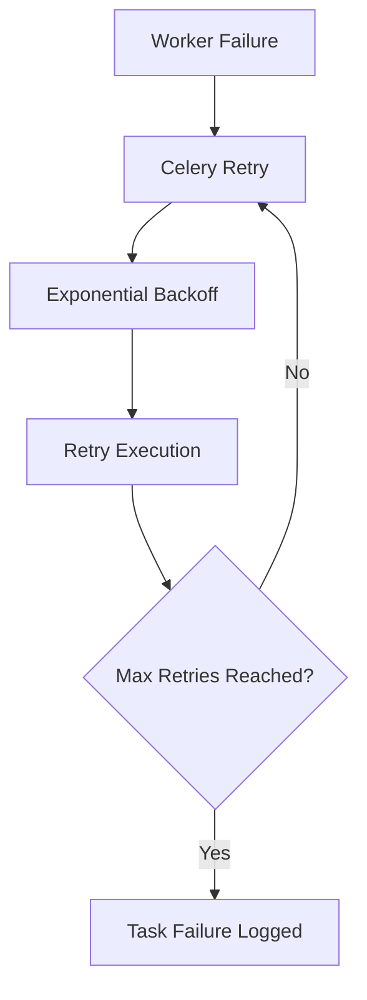

---

# 8. Transaction Lifecycle

---

# Standard Transaction Pattern

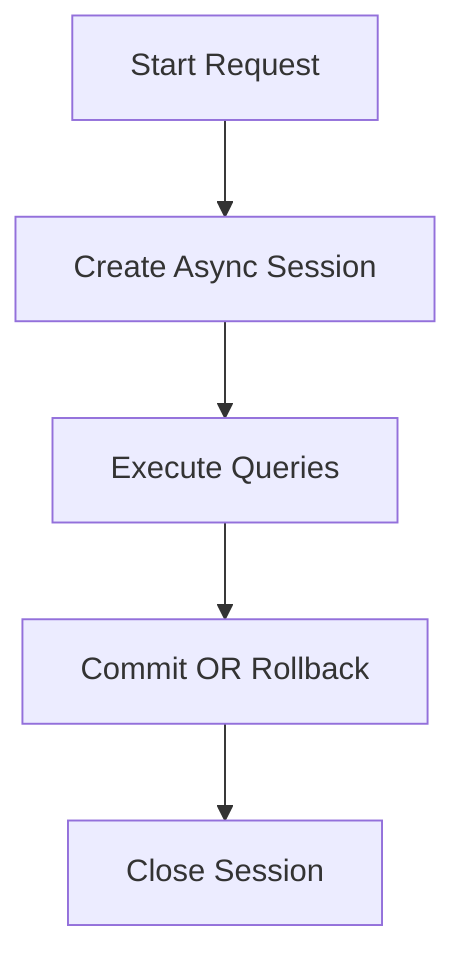

---

# Commit Ownership

Commits happen only inside service layer.

Repositories never commit transactions.

This centralizes transactional control.

---

# 9. Error Handling Workflow

---

# Validation Errors

```text
Pydantic Validation
   ↓
422 Response
```

---

# Missing Resources

```text
Repository Returns None
   ↓
HTTPException(404)
```

---

# Invalid Workflow

```text
State Machine Rejects Transition
   ↓
400 Response
```

---

# Concurrency Conflict

```text
Atomic UPDATE Affected 0 Rows
   ↓
409 Conflict
```

---

# Redis Failure

```text
Redis Exception
   ↓
Fallback to DB
```

---

# 10. Logging Workflow

---

# Cache Logging

```text
[CACHE HIT]
[CACHE MISS]
[CACHE SET]
[CACHE DELETE]
```

---

# Task Lifecycle Logging

```text
[TASK STATUS CHANGE]
[TASK QUEUED]
```

---

# Worker Logging

```text
[TASK WORKER START]
[TASK WORKER DONE]
```

---

# 11. Developer Notes

---

# Thin Routes

Routes should remain:

* lightweight
* validation-focused
* orchestration-free

---

# Business Logic Placement

All business rules belong in:

```text
services/service.py
```

---

# Repository Restrictions

Repositories should never contain:

* HTTP exceptions
* cache logic
* logging orchestration
* Celery logic

---

# Cache Rules

Any operation mutating task state must invalidate:

```text
task:{task_id}
```

and possibly:

```text
tasks:user:{user_id}
```

---

# Celery Rules

Only trigger background tasks after successful commit.

Never queue async jobs before persistence completes.

---

# 12. Workflow Summary

The API follows a production-oriented workflow architecture:

```text
Route
   ↓
Validation
   ↓
Service Orchestration
   ↓
Repository Persistence
   ↓
Cache Coordination
   ↓
Background Processing
   ↓
Structured Response
```

This design ensures:

* scalability
* maintainability
* concurrency safety
* async performance
* fault tolerance
* developer readability
* predictable execution flow